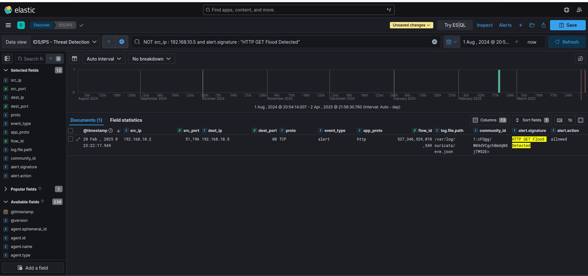
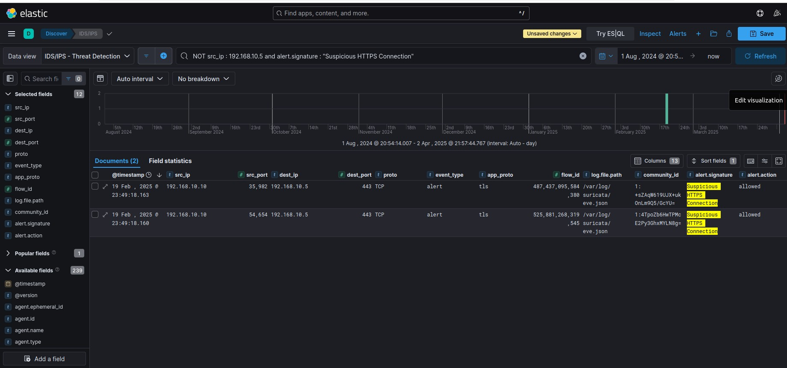
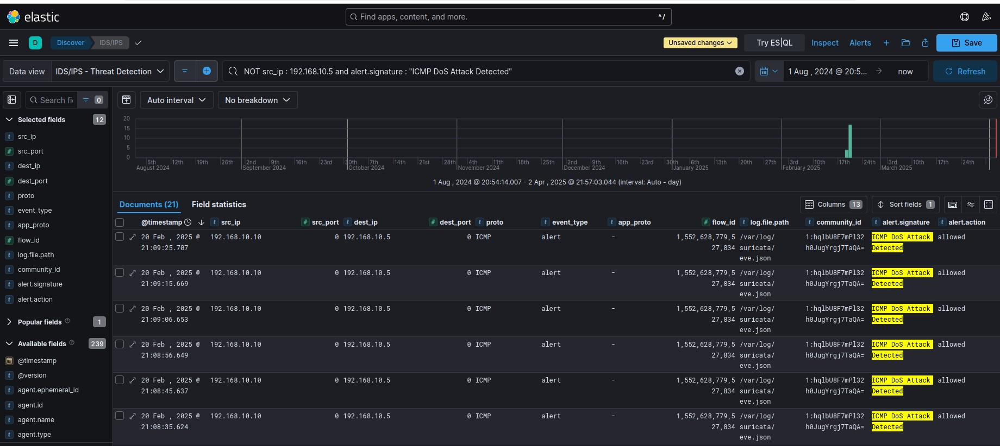
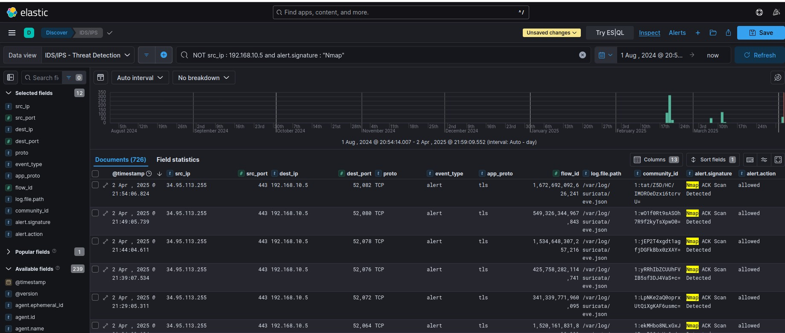
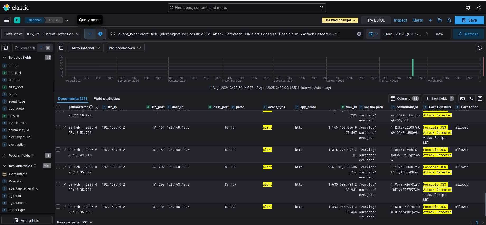
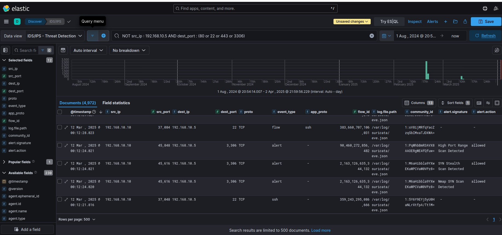
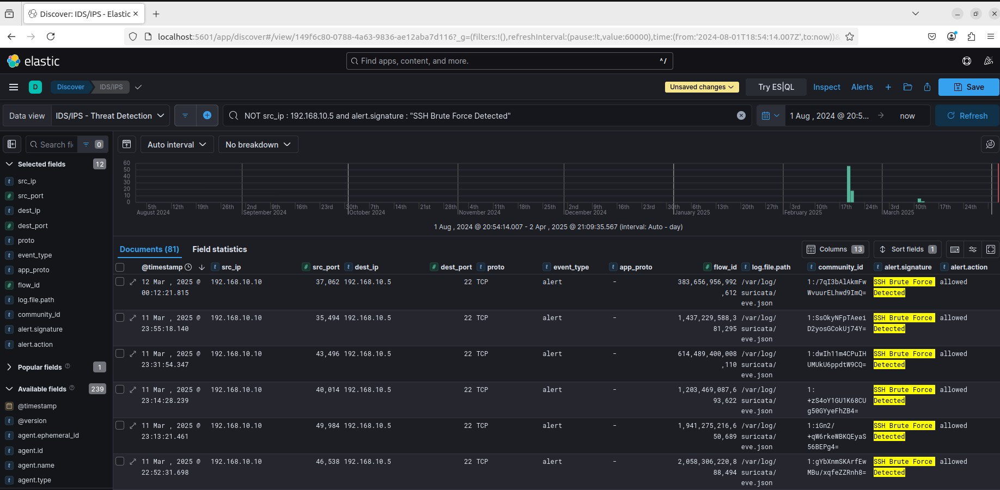

# 🛡️ Suricata Detection Rules - Captured Alerts

This document contains the Suricata detection alerts visualized in Kibana as part of the SOC Blue Team Lab project. Each alert represents a different threat scenario, demonstrated and analyzed within the environment.

## 🚀 1. HTTP GET Flood Detected

**Description:**  
A high volume of HTTP GET requests was detected, which is indicative of a Denial-of-Service (DoS) attempt, specifically an HTTP GET Flood attack.

## 🔒 2. Suspicious HTTPS Connections

**Description:**  
Multiple TLS/HTTPS connections were flagged as suspicious. This could indicate reconnaissance activity or automated scanning tools trying to enumerate HTTPS services.

## 🌐 3. ICMP DoS Attack Detected

**Description:**  
ICMP traffic flood detected. This behavior is typical of an ICMP DoS attack where the attacker tries to exhaust network resources using ICMP Echo Requests.

## 🔍 4. Nmap ACK Scan Detected

**Description:**  
Suricata detected a network scan consistent with Nmap ACK scan behavior. This scan type is used to map firewall rules and identify ports that are not filtered.

## ⚠️ 5. Possible XSS Attack Detected

**Description:**  
A potential Cross-Site Scripting (XSS) attack was detected, where malicious scripts might have been injected in HTTP requests to manipulate client-side scripts.

## 🧩 6. Services Ports Scan Detected

**Description:**  
Port scanning activity was identified targeting well-known service ports (SSH, HTTP, HTTPS, MySQL). This behavior is commonly associated with reconnaissance attacks.

## 🔑 7. SSH Brute Force Attack Detected

**Description:**  
Suricata detected repeated attempts to gain unauthorized access to the SSH service by brute force password guessing.

## 📄 Summary

All these events were generated in a controlled lab environment as part of threat detection, analysis, and Blue Team defense exercises using Suricata, ELK Stack, and Wazuh.

